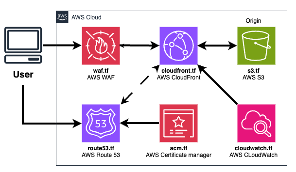

# Terraform S3 Project

This project is a Terraform configuration. It sets up a secure and scalable static website hosting architecture using AWS services. It is designed to demonstrate infrastructure as code (IaC) principles and provide a reusable template for Static Website.

## Features
### Amazon S3 – Static Website Hosting
- Stores static files like `index.html` and `error.html`.
- Configured with **static website hosting** enabled.
- **Public access is blocked** to prevent direct access to the S3 URL.
- Acts as the **origin** for CloudFront using **Origin Access Control (OAC)**.

### Amazon CloudFront – Content Delivery Network
- Serves content from the S3 bucket globally with low latency.
- Custom domain (e.g., `www.example.com`) integrated using **ACM SSL certificate**.
- Enforces **HTTPS via redirect**.
- **Origin Access Control** restricts direct S3 access, allowing only CloudFront.

### AWS WAF – Web Application Firewall
- Protects the CloudFront distribution.
- Blocks malicious traffic and common web exploits.
- Can be configured with AWS Managed Rules or custom rule sets.

### Amazon CloudWatch – Monitoring & Alerts
- Monitors:
  - **4xx / 5xx error rates**
  - **Cache hit rate**
  - **Origin latency**
 
### AWS Certificate Manager (ACM)
- Manages and provisions **SSL/TLS certificates** for the custom domain.
- Fully integrated with CloudFront for secure HTTPS delivery.
- Uses **SNI-only** and modern TLS settings (`TLSv1.2_2021`).

## Benefits
- Fully serverless, no backend infrastructure to manage.
- Fast global delivery using CloudFront.
- Secured via HTTPS and WAF.
- Real-time monitoring and alerts with CloudWatch.

## Prerequisites

- `AWS CLI Installed:` Ensure the AWS CLI is installed on your local machine.
- `AWS IAM Identity Center (SSO):` We'll use AWS IAM Identity Center to provision access for our user.
- `SSO Authentication:` The user will authenticate via SSO into the target AWS account where resources will be deployed.

- `Review and customize` the variables in `variables.tf` or create a `terraform.tfvars` file to override defaults.

| Variable           | Description                          | 
|--------------------|--------------------------------------|
| `domain`           | Domain name for the website          |
| `aws region`       | AWS region for the bucket            |
| `profile`          | AWS SSO Profile to be used           |
| `route53`          | ZXXXX ... Domain Hosted Zone ID      |


## Architecture Diagram

Below is the architecture diagram for the Terraform S3 Project:



## Usage

1. Clone the repository:
    ```bash
    git clone https://github.com/jdiaz2001/terraform-s3-project.git
    cd terraform-s3-project
    ```
2. Authenticate with your AWS SSO Profile
    ```bash
    aws sso login --sso-session "Profile_Name" 
    ```

3. Initialize the Terraform working directory:
    ```bash
    terraform init
    ```
    
4. Plan the infrastructure changes:
    ```bash
    terraform plan
    ```

5. Apply the configuration to create the S3 bucket:
    ```bash
    terraform apply
    ```

6. Confirm the changes and note the output values.

## Outputs
- `CloudFront URL`: URL for the Cloud Front Distribution.

## Cleanup

To destroy the resources created by this project, run:
```bash
terraform destroy
```
